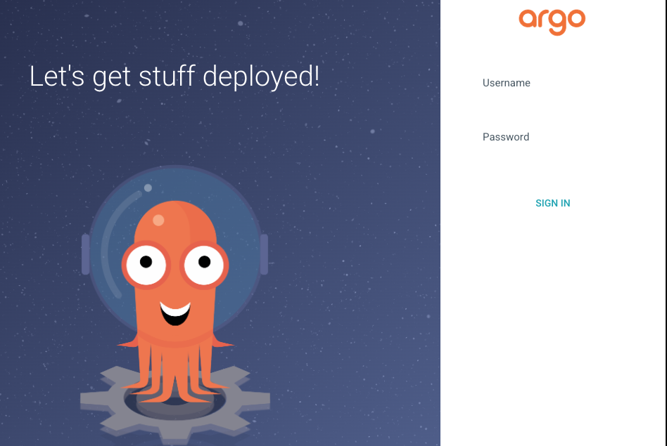
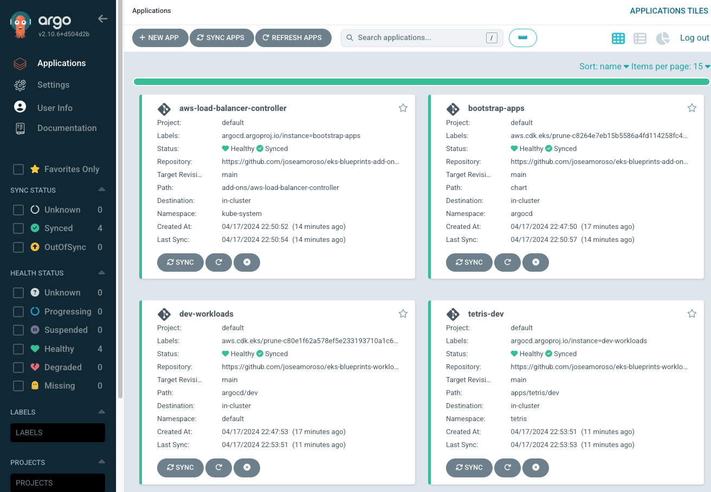
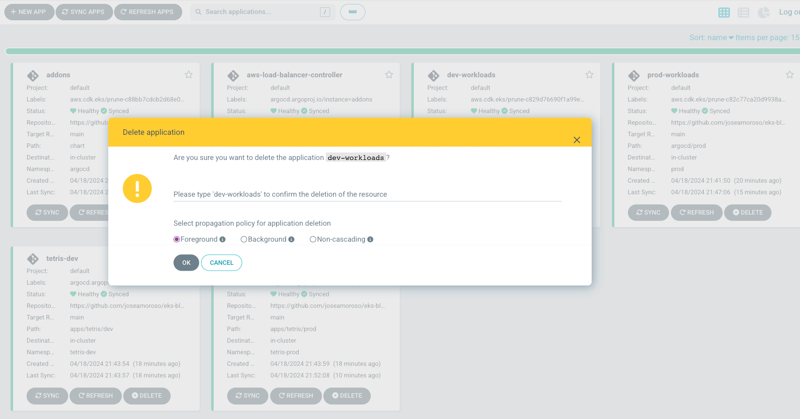

# Desplegando apps con EKS blueprints y GitOps

This tutorial will deploy an EKS cluster using the EKS Blueprints project and ArgoCD. Both tools allow us to manage our apps by using GitOps.

## EKS Blueprints and GitOps demo

### Pre-requirements

1. Create a directory where we’ll clone the git repositories.

```bash
mkdir ~/eks-blueprints-gitops && cd ~/eks-blueprints-gitops
```

2. Clone necessary repositories for the demo

```bash
# eks-blueprints-cdk-infra provides the IaC and ArgoCD initial settings
git clone https://github.com/joseamoroso/eks-blueprints-cdk-infra.git

# # eks-blueprints-app-sample is a Python application example  
# git clone https://github.com/joseamoroso/eks-blueprints-app-sample.git

# # eks-blueprints-add-ons contains helm charts and settings for addons
# git clone https://github.com/joseamoroso/eks-blueprints-add-ons.git

# # eks-blueprints-workloads-charts contains helm charts and settings for apps 
# git clone https://github.com/joseamoroso/eks-blueprints-workloads-charts.git
```

3. Install `aws-cdk` in your cli. Instructions here:

[Getting started with the AWS CDK - AWS Cloud Development Kit (AWS CDK) v2](https://docs.aws.amazon.com/cdk/v2/guide/getting_started.html#getting_started_install)

- (Optional) Install kubectl. Documentation:

[Install Tools](https://kubernetes.io/docs/tasks/tools/)

4. Get access to an AWS account where you have permissions to deploy the infrastructure.

### Instructions

1. Deploy the base infrastructure which include networking stack, EKS clusters, EC2 managed groups, IAM roles, security groups, etc.

```bash
# Install node dependencies
npm install 

# Compile and validate infra is working
npm run build 

# Configure programmatic access to AWS. Reference: https://docs.aws.amazon.com/cdk/v2/guide/getting_started.html#getting_started_auth

# Generate the desired infrastructure plan (Cloudformation files) for all resources that will be created with the current code
# Review the Cloudformation templates in the cdk.out directory. The main template should have a name like EksBlueprintsGitOpsABCD1234.template.json
cdk synthesize 

# Validate all resources that will be created with the current code
cdk diff 

# This will deploy the infrastructure without waiting for input confirmation and skipping the changeset
cdk deploy --all --require-approval never --method direct 

# Go and grab a cup of coffee, this could take up to ~30 min to complete :)
```

You will see an output similar to:

```bash
EksBlueprintsGitOpseksblueprintsgitopsdev1D5E6638.eksblueprintsgitopsdevClusterNameC071968A = eks-blueprints-git-ops-dev
EksBlueprintsGitOpseksblueprintsgitopsdev1D5E6638.eksblueprintsgitopsdevConfigCommand94EDA04B = aws eks update-kubeconfig --name eks-blueprints-git-ops-dev --region us-east-1 --role-arn arn:aws:iam::xxxxxxxxxxx:role/EksBlueprintsGitOpseksblu-eksblueprintsgitopsdevAcc-2tygo8e3AHdL
EksBlueprintsGitOpseksblueprintsgitopsdev1D5E6638.eksblueprintsgitopsdevGetTokenCommand3C3907DD = aws eks get-token --cluster-name eks-blueprints-git-ops-dev --region us-east-1 --role-arn arn:aws:iam::xxxxxxxxxxx:role/EksBlueprintsGitOpseksblu-eksblueprintsgitopsdevAcc-2tygo8e3AHdL
```

The second output allows us to update the local kube-config file and authenticate directly with the EKS cluster:

```bash
aws eks update-kubeconfig --name eks-blueprints-git-ops-dev --region us-east-1 --role-arn arn:aws:iam::xxxxxxxxxxx:role/EksBlueprintsGitOpseksblu-eksblueprintsgitopsdevAcc-2tygo8e3AHdL
```

The role assumed there,  was generated by the `eks-blueprints` module.

To see all the Kubernetes resources, we run:

```bash
kubectl get all -A
```

2. Add workloads and addons (including ArgoCD) settings for GitOps

```bash
git checkout gitops # Switch to branch that has the required changes
cdk diff # See new resources added and replaced
cdk deploy --all --require-approval never --method direct
```

3. Get ArgoCD secret for console access

```bash
kubectl -n argocd get secret argocd-initial-admin-secret -o jsonpath="{.data.password}" | base64 -d
```

4. Copy and store the password, as we will need it later
5. Forward traffic internally to expose ArgoCD on the local system

```bash
kubectl port-forward service/blueprints-addon-argocd-server -n argocd 8080:443
```

6. In a browser, navigate to `http://localhost:8080`, you will see a screen the following one:



By default the username is `admin` and password is the value stored in [step 3](https://www.notion.so/Desplegando-apps-con-EKS-blueprints-y-GitOps-f5861cc6e29741ebaa4b13ac81bc7438?pvs=21)

7. You should be redirected to ArgoCD dashboard:



8. Now you can add any change to `eks-blueprints-workloads-charts` or `eks-blueprints-add-ons` and you’ll see these changes being managed by ArgoCD.
Test the application in working.
(OPTIONAL) Add a record set for the ingress in the demo app:

```bash
HOSTED_ZONE_ID="Z012345ABCDEF"
aws route53 change-resource-record-sets \
    --hosted-zone-id YOUR_HOSTED_ZONE_ID \
    --change-batch '{
        "Changes": [
            {
                "Action": "UPSERT",
                "ResourceRecordSet": {
                    "Name": "YOUR_SUBDOMAIN",
                    "Type": "A",
                    "AliasTarget": {
                        "DNSName": "YOUR_ALB_DNS"
                        "EvaluateTargetHealth": true,
                        "HostedZoneId": "YOUR_ALB_HOSTED_ZONE_ID"
                    }
                }
            }
        ]
    }'
```

### Clean up

In ArgoCD console, remove workloads applications, in this case `dev-workloads` and `prod-workloads`:



After that, to destroy all AWS resources run:

```bash
cdk destroy --all
```

<aside>
💡 If stack deletion fails because of argocd namespace struct deletion error, skip the resource from deletion in Cloudformation console and delete the stack again.

</aside>
